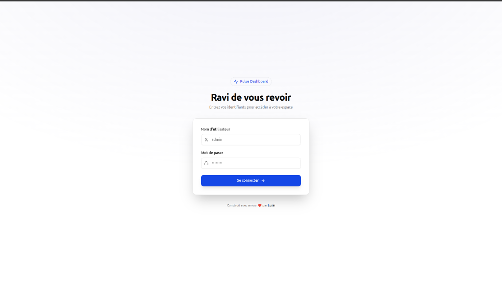
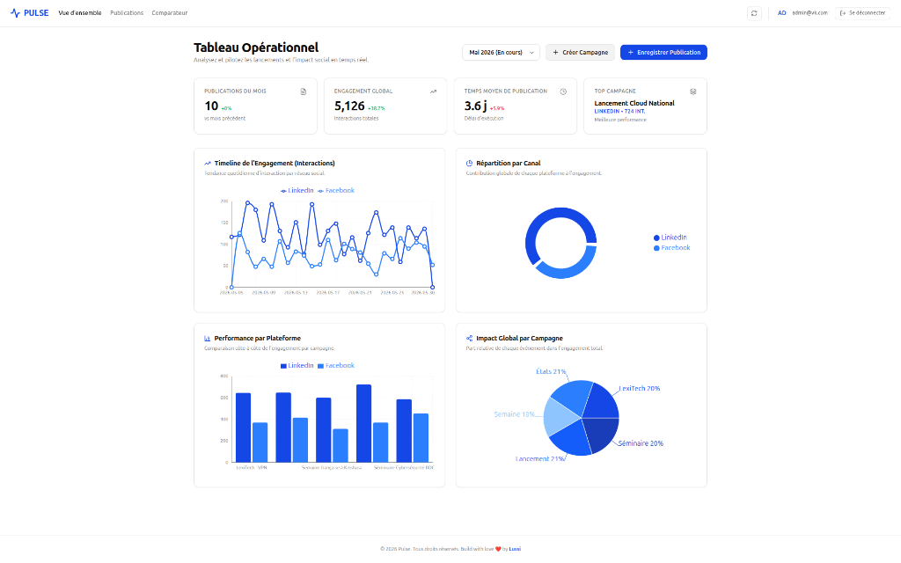

# Pulse - Dashboard Opérationnel & Analytique

Pulse est une application full-stack moderne permettant le suivi opérationnel, l'analyse et le pilotage des campagnes et publications sur les différents réseaux sociaux.



## 📋 Table des matières
- [Pulse - Dashboard Opérationnel \& Analytique](#pulse---dashboard-opérationnel--analytique)
  - [📋 Table des matières](#-table-des-matières)
  - [🎯 Aperçu](#-aperçu)
  - [✨ Fonctionnalités](#-fonctionnalités)
  - [🏗 Architecture](#-architecture)
  - [⚙️ Prérequis](#️-prérequis)
  - [🚀 Installation \& Démarrage Rapide (En Local)](#-installation--démarrage-rapide-en-local)
  - [🐳 Environnement de Développement (Docker)](#-environnement-de-développement-docker)
  - [📦 Déploiement en Production](#-déploiement-en-production)
  - [🔐 Authentification](#-authentification)

---

## 🎯 Aperçu

Conçu pour centraliser les performances des communications (publications LinkedIn, Facebook, X, etc.) en lien avec divers événements (internes ou externes), Pulse offre des KPIs en temps réel, des graphiques avancés et un gestionnaire intuitif pour créer et modifier vos publications.



## ✨ Fonctionnalités

- **Tableau de Bord Global** : Vue d'ensemble des interactions totales, publications du mois, temps moyen de publication (Lead Time) et l'identification de la meilleure campagne.
- **Graphiques Intéractifs** :
  - Timeline de l'Engagement par plateforme
  - Répartition par canal de communication
  - Performance comparative par plateforme
  - Impact global par campagne (parts relatives)
- **Filtres par Période** : Sélecteur de mois dynamique pour recalculer l'ensemble des métriques.
- **Registre des Déploiements** : Page de suivi sous forme de tableau détaillé (pagination, filtres, recherche).
- **Comparateur de Périodes** : Page permettant la sélection de deux mois différents pour une comparaison directe (côte-à-côte) des KPIs et performances.
- **Espace Sécurisé** : Interface protégée par nom d'utilisateur et mot de passe, avec un token JWT asymétrique (HMAC SHA-256) géré dynamiquement.
- **Responsive Design** : Interface minimaliste et performante, avec le support natif des composants de style *Shadcn*.

---

## 🏗 Architecture

Le projet adopte une structure **Monorepo** orchestrée avec npm workspaces (ou Turborepo/pnpm).

- **Frontend (`apps/web`)** : Next.js (App Router), React, Tailwind CSS, Recharts, Lucide React.
- **Backend (`apps/api`)** : NestJS, API RESTful, Auth Guards.
- **Base de données (`packages/database`)** : Prisma ORM, base de données SQLite (facilement modifiable vers PostgreSQL).

---

## ⚙️ Prérequis

- **Node.js** (v18 ou supérieur recommandé)
- **Docker** et **Docker Compose** (pour l'exécution conteneurisée)

---

## 🚀 Installation & Démarrage Rapide (En Local)

1. **Cloner le dépôt** :
   ```bash
   git clone <url-du-depot>
   cd pulse
   ```

2. **Installer les dépendances** (à la racine du monorepo) :
   ```bash
   npm install
   ```

3. **Générer le client Prisma et initialiser la base de données** :
   ```bash
   npm run db:generate --workspace=@pulse/database
   npx prisma db push --schema=packages/database/prisma/schema.prisma
   ```

4. **Construire les paquets internes** :
   ```bash
   npm run build --workspace=@pulse/database
   ```

5. **Démarrer les serveurs de développement** :
   Vous pouvez démarrer l'API et le Web séparément :
   ```bash
   npm run dev --workspace=@pulse/api
   npm run dev --workspace=@pulse/web
   ```

L'application Web sera accessible sur [http://localhost:3000](http://localhost:3000) et l'API sur [http://localhost:3001](http://localhost:3001).

---

## 🐳 Environnement de Développement (Docker)

Un fichier `docker-compose.dev.yaml` est fourni pour lancer l'ensemble de la pile avec le rechargement à chaud sans avoir besoin d'installer Node localement.

```bash
docker compose -f docker-compose.dev.yaml up --build
```
*Note : Les dossiers locaux sont montés en volumes. Vos modifications de code se refléteront immédiatement.*

---

## 📦 Déploiement en Production

Pour le déploiement de production, utilisez le fichier standard `docker-compose.yml`.

1. Configuration des variables d'environnement (dans `docker-compose.yml` ou un fichier `.env`) :
   ```env
   # Définir l'administrateur système pour l'amorçage
   ADMIN_USERNAME=admin
   ADMIN_PASSWORD=mon_mot_de_passe_secret

   JWT_SECRET=une_clé_secrète_pour_le_jwt
   
   # Configurer les URLs
   NEXT_PUBLIC_API_URL=http://api:3001
   ```

2. Lancer les conteneurs optimisés :
   ```bash
   docker compose up -d --build
   ```

---

## 🔐 Authentification

Lors du **premier démarrage** du backend (via NestJS), un script de provisionnement (`create-admin.js`) vérifie si la base de données possède des utilisateurs. Si elle est vide, le script crée automatiquement le compte administrateur basé sur les variables `ADMIN_USERNAME` et `ADMIN_PASSWORD`.

Le mot de passe est haché en SHA-256 dans la base de données. Tous les endpoints API d'analyse et de publication nécessitent un token d'autorisation généré lors du `/api/auth/login`.

---

## 🛡️ Sécurité & Audits

La sécurité de Pulse est assurée et continuellement vérifiée à l'aide d'outils d'audit de référence :

- **Herozion CLI ([herozion.io](https://herozion.io))** : Utilisé pour les scans approfondis du code source, la détection des failles applicatives (SAST) et la vérification des bonnes pratiques de sécurité au sein du monorepo.
- **Trivy** : Intégré pour l'analyse des vulnérabilités au niveau du système de fichiers, des dépendances (`package-lock.json`) et des images Docker. Les alertes remontées (ex: CVE sur des packages comme `postcss` ou `qs`) sont traitées et fixées de manière proactive via la configuration `"overrides"` de npm et `npm audit fix`.

---

*Build with love ❤️ by Lussi*
